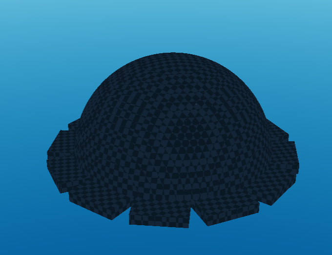
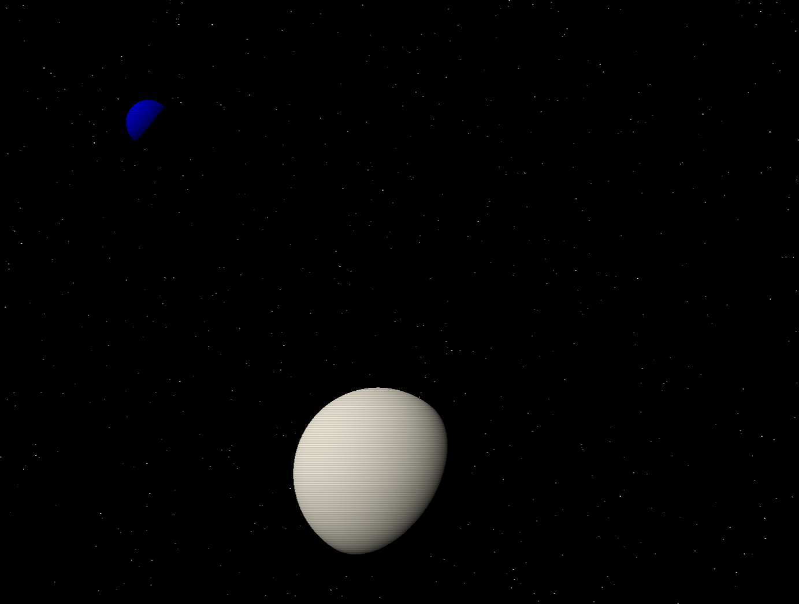
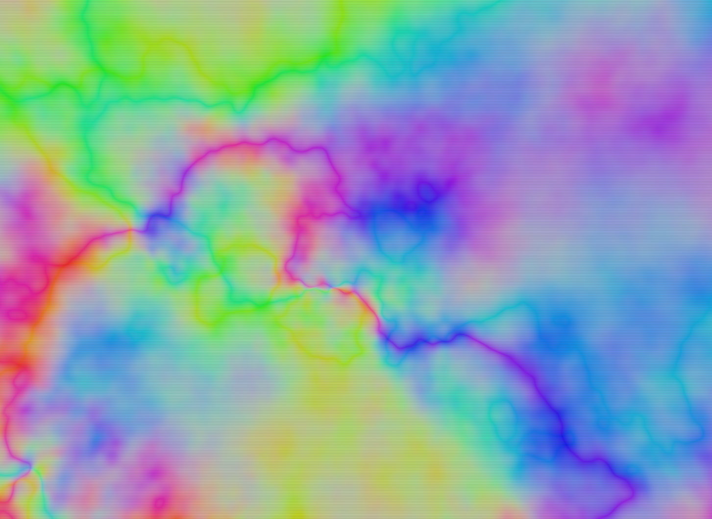
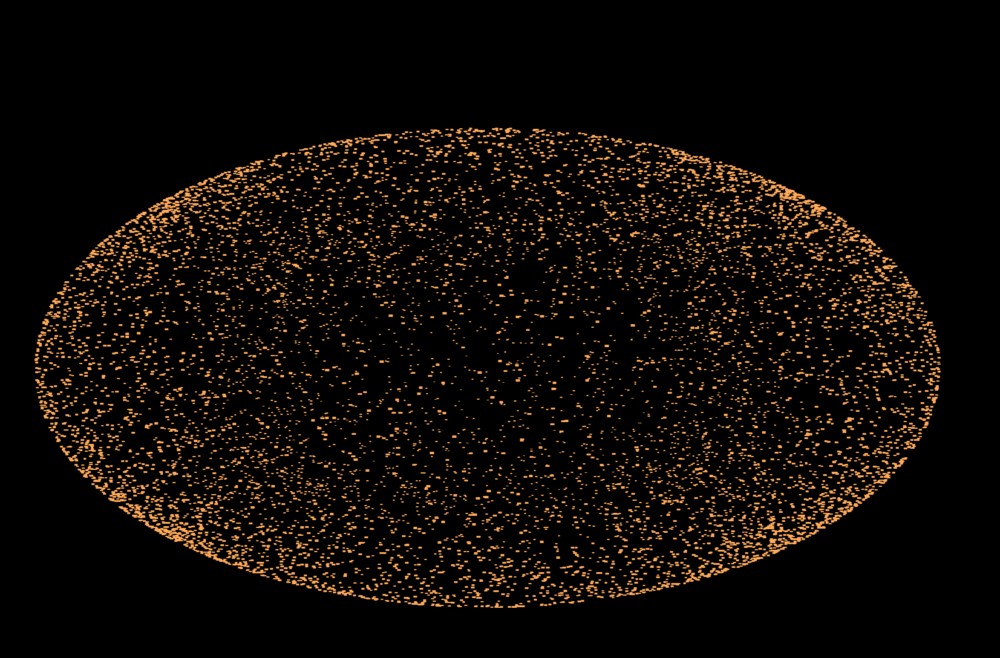
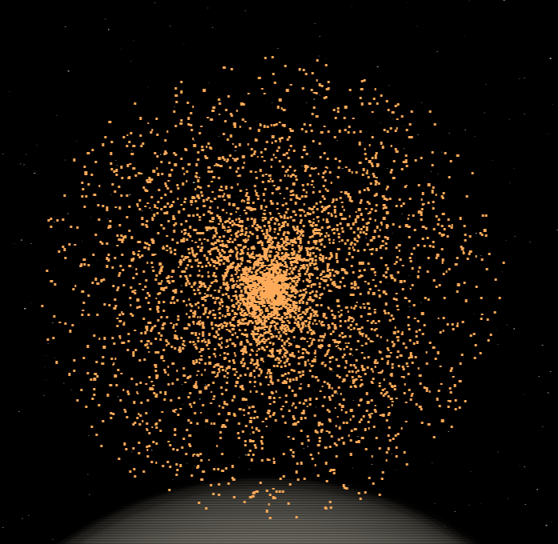
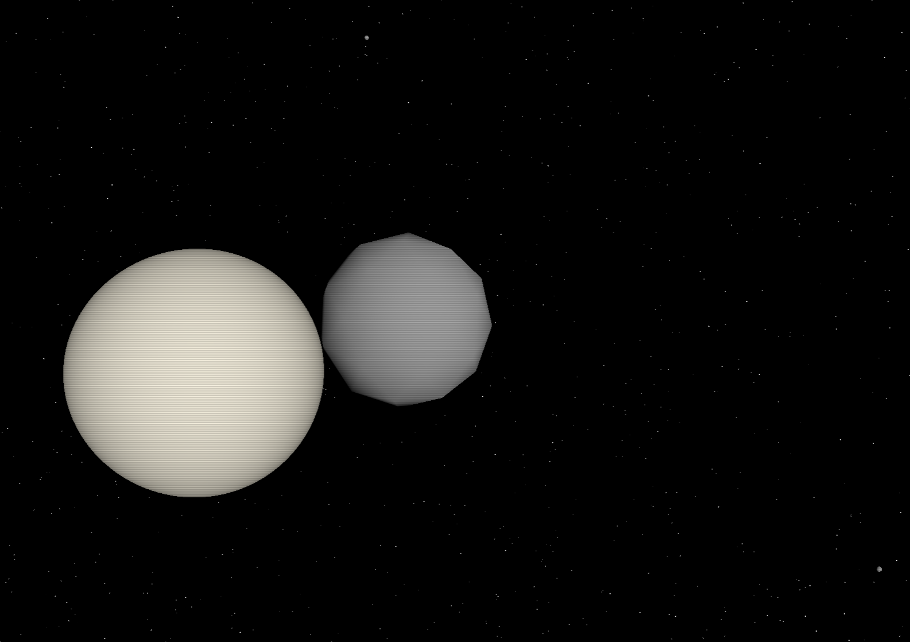
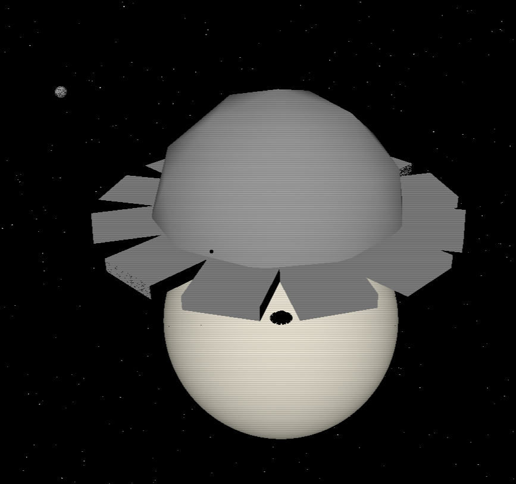

# Projektbericht

## Florian

Ich hatte mit einer simplen, linearen Kamerafahrt begonnen. Danach habe ich einen Asset Manager erstellt, welcher alle Objekte verwaltet. Über diesen Asset Manager kann man bestimmen wann welche Objekte wo spawnen und despawnen. Die Kamerafahrten sahen mir aber zu fade aus. Deswegen setzte Keyframe-Interpolation(Spline) um, weswegen ich mithilfe von Catmull-Rom eine Methode erstellt habe, welche aus 4 Punkten eine Kurve machen. Danach habe ich keyframes eingeführt, welche die Position und Tatget der Kamera und deren Zeiten enthalten. Diese werden als Punkte auf der Kurve genutzt, um die gesamte Kamerafahrten zu einer smoothen Kurve zu machen. Die Kameraposition und -target besitzen ihre eigene Kurve. Mit der Funktion moveCamera gibt man an wohin sich die Kamera bewegen soll. Es startet bei unserer gewählten Startposition fightPos. Bei moveCamera kann man außerdem die Geschwindigkeit wählen, wie schnell sich die Kamera auf die angegebene Position und Target bewegen soll. 

So sah es in main.cpp umgesetzt aus:


Damit konnte man zwar alles machen, aber um Szenen einfach zu bauen und die Reihenfolge der Szenen frei wählen zu können, haben wir in cinematic.cpp Szenen hinzugefügt. Mit diesen kann man einstellen, wie die Kamera sich verhält, welche Objekte spawnen und despawnen und auch die Zeiten genau einstellen für ein passendes Timing. Auch die Laser und Explosionen können in diesen festgelegt werden. Hier die erste Szene als Beispiel:


Nachdem dann alle Szenen erstellt sind kann man diese mit push_back in die Liste der durchlaufenden Szenen hinzufügen und somit das Video wie gewünscht aufbauen.

Als Filter hatten wir uns einen CRT Effekt ausgesucht, um dem Zuschauer glauben zu lassen, dass eine echte Kamera die Aufnahme macht. Für CRT Effekt suchte ich auf shadertoy.com  nach Inspiration. Meine erste Wahl war schwer umsetzbar, weil ich einen eigenen Buffer dafür zusätzlich erstellen musste. Nach weiterer Suche fand ich eine noch bessere Inspiration: Fast CRT von kbjwes77. 


Ich habe in unserer main.cpp Regler für den Warp und Scandes CRT Effekts eingefügt, sodass wir die Effekte testen und passende Werte finden können. Danach habe ich den Code der Internetseite auf unser Projekt angepasst und diesen in den Shader gepackt. Die Ränder wurden Schwarz und das Bild anhand der Distanz zur Mitte des Bildes gewarped, sodass die Ränder mehr gewölbt sind als die Mitte. Die Scanlines werden in einer Sinuskurve, die senkrecht verläuft, gewählt, sodass die horizontale immer die gleiche Farbe haben. Die Spitzen sind dabei dunkler. Der Wert Scan gibt an, wie dunkel diese Linien sind. Das Ergebnis sieht damit aus wie horizontale Scanlines einer alten Monitors.


Danach wollte ich Bewegungsunschärfe umsetzen. Doch unsere Objekte waren noch nicht fertig und bewegten sich noch nicht mit der Zeit. 


Außerdem lief unser Projekt bereits recht langsam, sodass Bewegungsunschärfe dieses Problem nur vergrößern würde. Deshalb hatte ich mich dafür entschlossen, dass ich stattdessen Fokusunschärfe mache, aber diese nur während den Explosionen aktiviere. Damit leiden unsere FPS nicht so sehr und gibt den Explosionen mehr Wucht. Für die Fokusunschärfe habe ich einen Offset im Shader erstellt, welcher von innen nach außen sich vergrößert. Danach habe ich jeden Pixel so oft wie unsere Sample Menge gerendert, wobei jeder durchlauf leicht verschoben war. Danach wurde der Durchschnitt der Farbe jedes Pixels gemacht, sodass die Pixel nicht n-mal so hell sind. Die Distanz der Fokusunschärfe ist immer die Distanz der Kamera zu dessen Target, sodass das Ziel immer im Fokus ist. Zum Schluss habe ich den Explosionen eine boolische Funktion angehangen, wenn es eine Explosion gibt und die Fokusunschärfe immer dann aktiviert. Nach jeder Explosion gehen die Werte der Unschärfe langsam und nicht auf einmal wieder runter.

## Dennis

Meine Themen waren:
1. Algorithmisch erzeugte Geometrie
2. Boolesche Geometrie
3. Partikelsysteme

### Der Anfang

Da ich als erstes Zeit gefunden hatte um mit dem Projekt anzufangen, habe ich
zuerst unsere ganze Devumgebung erstellt. Darunter zählt:
- das repository erstellen
- via [devenv](https://devenv.sh/) alle Abhängigkeiten und Skripts definieren,
damit ich und meine Gruppe alles gleich installiert haben
- den Code von Aufgabe 4a kopieren
- und die README erstellen, damit mein Team weiß wie man devenv benutzt

Als dann der erste, Florian, versucht hatte die Devumgebung zu benutzen, hatte
er einige Probleme mit OpenGL. Das lag daran, dass devenv auf Nix basiert, wo
dynamische Bibliotheken, wie OpenGL, ein wenig anders funktionieren. Da er (und
Noah) kein NixOS benutzt, mussten wir erst einmal recherchieren, wie man das
Problem behebt. Am Ende ging das jedoch recht leicht, indem man das Program mit
[nixGL](https://github.com/nix-community/nixgl) startet. Das ganze haben wir dann
im `build` und `run` Skript versteckt.

### Die ersten 2 Features

Der Grund warum ich den Code der 4a in dieses Projekt am Anfang kopiert hatte war,
dass ich dort schon Algorithmisch erzeugte Geometrie via Raymarching implementiert
hatte. Dadurch konnte ich Feature Nummer 1 abhaken. Zufälligerweise war dort
der Code fürs Shadow Mapping, was Noah eigentlich hätte implemtieren müssen,
schon vorgegeben gewesen.

Danach habe ich mich an die Boolesche Geometrie gesetzt. Anfangs dachte ich, dass
es relativ schwer werden würde zu implementieren, jedoch habe ich nach kurzer
Google suche folgende Webseite gefunden: <https://iquilezles.org/articles/distfunctions/>

Nachdem ich die folgenden 8 relevanten Zeilen kopiert hatte, konnte ich den
OLDMAN (das 200km große Raumschiff aus den Perry Rhodan Büchern) recht leicht
zusammenbauen und rendern:

```glsl
float intersectSDF(float distA, float distB) {
  return max(distA, distB);
}
float unionSDF(float distA, float distB) {
  return min(distA, distB);
}
float differenceSDF(float distA, float distB) {
  return max(distA, -distB);
}
```

Damit ich auch sehen konnte, was ich überhaupt programmiere, habe ich auch noch
ganz schnell ein paar Controls für die Kamera hinzugefügt. (WASD Controls und
Hoch- und Runterfliegen)

Das Resultat zu diesem Zeitpunkt sah so aus:



Rückblickend waren die 12 Sektionen nicht weit genug draußen. (Man kann hier
nur die ersten 25km von denen sehen)

Ab da hatte ich gemerkt, dass es ein paar Performance Probleme gibt. Um diese zu
mitigieren, habe ich zuerst alle 12 Sektionen aufeinmal rendern lassen, indem
ich eine Box 11 weitere mal im Kreis spiegele. Die Mathematik dafür verdanke ich
wieder einem Artikel von <https://iquilezles.org/>. Als zweites habe ich dann
alles um ein Faktor 1000 geschrumpft.

Bevor Florian und Noah dann richtig angefangen haben am Projekt zu arbeiten,
habe ich noch die Angreifer, einfache, algorithmisch erzeugte Kugeln, erstellt.

### Exkurs: Multifile Shaders

Irgendwann wurde der Code dann im Fragment Shader immer mehr, wodurch man die
Übersicht verlor. Daher habe ich versucht, den Shader in mehere Dateien via
`#include` Instruktionen aufzuteilen. Leider gibt es im Framework irgendeinen Bug,
wodurch beim verändern der Shaderdateien (kein C++ Code!) und Kompilieren des Projektes
entweder dutzende Makros fehlschlagen oder vergessen wird, dass die glm Bibliothek
heruntergeladen wurde. Der einzige Fix dafür war es den build Ordner zu löschen
und alles noch mal neu zu kompilieren.

Damit ich, und mein Team, das nicht jedes mal machen mussten habe ich meinen
eigenen kleinen Shader preprocessor geschrieben, der einfach nur die ganzen
`#include`'s auflöst und das Resultat an den Shader Compiler vom Framework
weitergibt.

### Himmelskörper und Hintergründe

Nach diesem kleinem Exkurs habe ich noch die Erde und den Mond erstellt (wieder
algorithmisch erzeugte Kugeln) und sowohl den Stern- als auch Linearraumhintergrund
(das bunte Wabern welches ebenfalls aus den Perry Rhodan Büchern inspiriert ist)
programmiert. Letzteres benutzt eine mehrfach gestaffelte Perlin Noise Funktion
welche ich (mit Lizenz) importiert hatte.

Erde und Mond mit Sternenhintergrund:



Bei der Bewegung der Kamera flackern die Sterne ein bisschen, jedoch konnte ich
das nie fixen ohne ein statisches Bild in die Skybox zu laden. Grund dafür ist,
dass ich die `rayDir`'s auf Integer runden muss, damit ich eine Hashfunktion
benutzen kann, ohne dass sich der Sternenhimmel bei jeder Bewegung komplett
verändert.

Linearraumhintergrund. Hier leider nur ein statisches Bild davon. Im Programm
wabert dieser förmlich:



### Partikelsystem

Jetzt wo es nichts mehr gab, mit dem ich mich weiter drücken konnte, habe ich
an das Partikelsystem setzen müssen. Wie ich befürchtet hatte, war dieses System
nicht gerade leicht umsetzbar.

Zu allererst habe ich mich auf die Suche gemacht, wie man sowas normalerweise
implementiert. Folgender Artikel hat dabei meine Implemention sehr stark inspiriert:
<https://www.opengl-tutorial.org/intermediate-tutorials/billboards-particles/particles-instancing/>

Damit ich mich aber erstmal aufs wesentliche konzentrieren konnte, habe ich erst
eine minimale Version, ohne OLDMAN und was auch immer wir schon gemacht hatten,
erstellt. In dieser konnte ich dann, via Instanzierung und Offsets in einem
`GL_ARRAY_BUFFER` folgende Explosionen implementieren. Die Partikel sind hierbei
auch gebillboarded, damit man auch wirklich alle jederzeit sieht.



Dies ist aber nur ein Standbild von Partikeln, welche in der Mitte spawnen und
sich gleichmäßig nach außen ausbreiten, bis sie despawnen. Die Explosion ist hier
zudem auch gestreckt, was später in der Integrierung, ohne mein zutun, weging.

Wie man sich bestimmt denken kann habe ich dann diese minimale Version, in Form
der `Explosions` Klasse in die `MainApp` Klasse integriert. `Explosions` hatte
dabei ihr eigenes Shaderprogramm, Mesh und Daten natürlich. In Prinzip liefen ab
diesem Zeitpunkt zwei Programme, welche nacheinander zum gleichen Bildschirm
rendern.

Nachdem ich noch zufällige Geschwindigkeiten und eine Kasinomäßige
Überlebensberechnung der Partikel hinzugefügt hatte sahen die Explosionen wie
folgt aus:



### Der große Rewrite zum Raytracing

Ich hatte während der ganzen Zeit das Gefühl, dass meine Implemenierung der
Booleschen Geometrie ungenügend war. Immerhin gab dieses Feature einem 60 Punkte!
Für meine Implementation ca 8 Punkte pro Zeile! Daher habe ich eine Email
geschrieben und tatsächlich: Meine Implementation war ungenügend. Also habe ich
mich für ein Abend drangesetzt und all den Raymarching code zu Raytracing
umgeschrieben. (Der Rewrite war nötig, da vernünfige Boolesche Geometrie zwei
Meshes miteinander Addiert, Subthrahiert usw. Und dies ging mit Raytracing
wesentlich leichter und Performanter als mit Raymarching)

Eine große Hilfe war hierbei der Code von Aufgabe 4b, da die grundlegenden Dinge
hier schon implementiert waren. Danach musste ich jedoch all den alten Code
rüberportieren, was glücklicherweise zum großteil copy-paste war.

Als erstes implementierte ich hierbei die algorithmisch erzeugte Geometrie. Um
genauer zu sein, nur die Kugeln, da wir nur Raumschiffe und Himmelskörper
generieren. Da deren Geometrie recht leicht ist, ist auch die Schnittpunktberechnung
relativ kurz, wobei ich hier ein paar Versuche gebraucht hatte, bis alles richtig
aussah. Meistens lag es an irgendwelchen Vorzeichen.

Die Boolesche Geometrie habe ich mir dann aber für später aufgehoben, da der
Abend schon langsam spät wurde und ich erstmal den Port fertig kriegen wollte.
Stattdessen habe ich eine einfache, aus Dreiecken bestehende Kugel statt dem
OLDMAN rendern lassen, sodass Florian und Noah schomal etwas hatten womit sie
arbeiten konnten.

Danach habe ich Stück für Stück den alten Code in den neuen integriert und dabei
auch ein wenig aufgeräumt. Traurigerweise, für Noah, musste die bereits gegebene
Shadow Mapping Logik später nochmal überarbeitet werden, damit Schatten von
Meshes auf algorithmisch erzeugte Geometrie, und anders rum, geworfen werden
konnten. Den Code für den großen blauen Laser habe ich aus Zeitgründen auch nicht
portieren können.

Das Ergebnis zu diesem Zeitpunkt sah dann wie folgt aus.



In der Mitte den OLDMAN Placeholder, links den Mond und ganz klein oben in der
Mitte und unten rechts zwei Angreifer.

### Boolesche Geometrie

[Meine Einschätzung](./idee/supernova.excalidraw.png) hat sich somit nun doch
bewahrheitet: Boolesche Geometrie ist mein schwerstes Feature.

Ersteinmal habe ich jedoch, wie üblich, nachrecherchiert und ein paar viele
Methoden zur Boolesche Geometrie mit Meshes, oder auch Constructive Solid
Geometry (CSG) gennant, gefunden. Entschieden habe ich mich aber für den Ansatz
mit den Intervallen. Im Prinzip, das was [hier](https://www.reddit.com/r/opengl/comments/djve71/how_to_create_cuttedhollow_objects_using_ray/)
beschrieben wird. Der Grund warum ich mich dafür entschieden hab, war, dass
ich nicht nochmal alles umschreiben wollte, was ich z.B bei der [z-Buffer Methode](http://www.nigels.com/research/egsggh98.pdf)
hätte tun müssen.

Da der OLDMAN aus 15 Meshes (inkl. der Meshes, die andere subthraieren) besteht
und ich nicht 3 Uniforms pro Mesh erstellen wollte, was im Code der Aufgabe 4b
getan wurde, habe ich erstmal mein eigenes Mesh Struct `SNMesh` erstellt, welches
ich zwischen C++ und den GLSL Shadern via einem Buffer teilen konnte. `SNMesh`
hat zudem auch ein paar Methoden bekommen, mit denen man das Mesh Skalieren,
Positionieren und Rotieren kann. Das ganze hat jedoch ein wenig länger gedauert,
da ich recht oft auf Alignment Probleme gestoßen bin, welche jedes mal mein
Window Manager / die Grafikarte hard resetted haben, weil der Shader irgendeinen
Speicher ließt, der verboten ist. Auch hat das Framework hier immer mal wieder
vergessen, dass die glm Bibliothek installiert war, weswegen ich recht oft den
build Ordner löschen und alles nochmal neu kompilieren musste. Der fix war am
Ende ein `alignas(16)` Statement im Struct und die Benutzung von vec4 statt vec3,
da erstere 16 Byte statt 12 Byte groß sind. Mit vec3 hätte ich sonst die Arrays
manuell puffern müssen.

Als ich diese Hürde dann aber überstanden habe konnte ich endlich mit dem OLDMAN
anfangen. Zu allererst habe ich hierfür noch ein Struct für den OLDMAN erstellt,
welches dann alle nötigen `SNMesh`'s enthielt. Dieses Struct habe ich dann
ebenfalls via Buffer mit dem Shader geteilt. Die enthaltenen `SNMesh`'s wurden
bei der Initialisierung dann direkt richtig Skaliert, Positioniert und Rotiert,
sodass ich mich im späteren CSG Code nurnoch um die Subthraktionen, Additionen usw.
kümmern musste.

Danach habe ich die Interval-Methode in den Shadern implementiert. Hier habe ich
jedoch etwas neues über GLSL gelernt: Man kann Daten nicht referenzieren. Das
hatte zur Folge, dass jedesmal wenn ich ein Mesh über die Funktionsparameter
übergeben hatte oder ich das Mesh in einer lokalen Variable zwischenspeicherte,
der GPU mehr als 4 kb kopiert hat, ein Memory overflow hatte und mein Window
Manager zum Hard Reset der Grafikkarte zwang. Die Lösung hier war es indices in
den Buffer zu übergeben, sodass die Funktion sich dann die Werte selber holt.

Nachdem ich aber all dies und noch ein paar andere Fehler gefixt hatte sah das
ganze so aus:



Die Artefakte die man an den Seiten der Sektionen sieht, kommen vom Shadow
Mapping und haben nichts mit der Implemention der Booleschen Geometrie zu tun.

### Export als MPEG-4-codierte Videodatei

Als aller letztes habe ich noch versucht unsere Animation als Videodatei zu
exportieren. Die Idee, welche [hier](https://stackoverflow.com/questions/19070333/saving-the-opengl-context-as-a-video-output)
wahrscheinlich besser beschrieben ist, war es das fertig gerenderte Bild von
OpenGL via einen Pixel Buffer zu holen und dann mit ffmpeg bzw. dessen Bibliotheken
zu einer mp4 Datei zu exportieren. Audio habe ich hierbei erstmal garnicht
betrachtet, da ich zuerst das Video hinkriegen wollte. Im nachhinein war es eine
gute Entscheidung.

Den Export an sich habe ich recht schnell umgesetzt bekommen. Nachdem ich den
Prototypen einigermaßen (aber nicht komplett!) aufgeräumt hatte, konnte ich mich
den zwei großen, verbliebenen Problemen stellen:
1. Das Video rendert nur in einer festcodierten Größe (800x600). Beim Vergrößern
des Programmfensters wird das Video einfach auf die untere linke Ecke gecroppt.
2. Die Simulation läuft nicht in diskreten Zeitschritten. Dadurch ist die
Framerate nicht konstant, wodurch das Video, je nach Performance des PCs (vermute
ich), entweder in slowmo und im Zeitraffer läuft. Bei mir tratt ersteres ein, da
ich ca 100fps hatte, das Video jedoch mit festen 30fps gerendert wurde.

Ich vermute das erste Problem ließe sich recht leicht beheben. Spontan würde mir
einfallen, dass man das Fenster einfach auf z.B 2k Auflösung setzt und dann
weitere Änderungen der Fenstergröße vom Betriebssystem verbieten lässt.

Das zweite Problem sollte eigentlich auch recht "leicht" behebbar sein. Meine
Idee wäre es hier einfach gewesen mein eigenes Deltatime zu managen, welches ich
in jedem update() loop um 0,03s (Zeitbudget für 30fps) erhöhe. Danach würde ich
dann einfach die überschüssige Zeit, welche bei guten PCs sicher da sein wird,
abwarten. Dadurch hätte ich dann für jeden PC garantiert, dass das Video mit
flüssigen 30fps gerendert wird.

Mein Problem war aber Zeit. Schließlich hatte ich noch einige Klausuren für die
ich lernen musste. Zeit war mein Problem, da mein Team die Main Klasse, wo unser
Render loop liegt, so verkompliziert haben, dass ich nicht mehr ohne weiteres
die oben genannten Änderungen in einem so kleinem Zeitraum implementieren konnte.
(Ich hatte nur noch 1 Tag Zeit) Mit dieser Erkenntnis musste ich also leider den
Versuch des Videoexports abbrechen.

### Schlusswort

Allem in allem bin ich recht zufrieden mit meinen Ergebnissen. Was meine
Einschätzung der Schwierigkeiten der Features anging, hatte ich wohl auch recht
behalten. Das Aussehen vom OLDMAN, der Angreifer und den Hintergründe ist dabei
besser geworden als ich erwartet hatte. Das gilt vorallem für den Linearraum.

Hätte ich aber mehr Zeit gehabt, hätte ich jedoch gerne noch ein wenig an der
Performance geschraubt. Vorallem im Bereich der CSGs, da diese unser größtes
Bottleneck sind. Möglicherweise hätte ich hier irgendwie Boundingboxes benutzen,
oder alles auf dem CPU vorausberechnen lassen können.

Das, was ich aber auf jedenfall mitnehmen werde, ist das Raymarching langsam ist.
Vorallem wenn man noch CSGs dazu benutzt und alle Werte in den Tausendern hat.

### Nutzung von KI

Zur Recherche und dem Prototyping von Lösung habe ich unter anderem KI benutzt.
Die Finalen Ergebnisse wurden jedoch zu 90% von mir programmiert.
