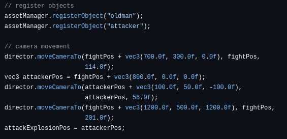
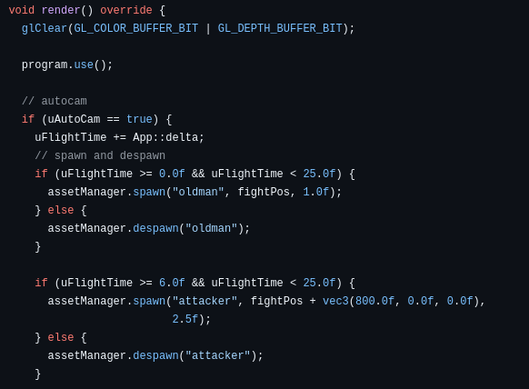
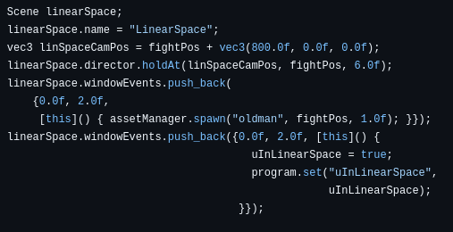
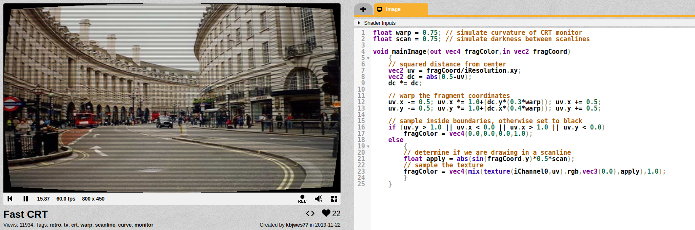
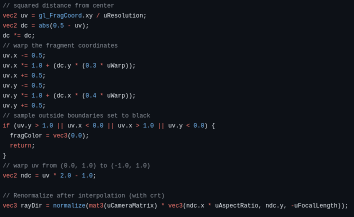
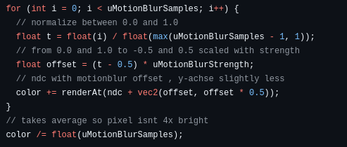

# Projektbericht

## Florian

Ich hatte mit einer simplen, linearen Kamerafahrt begonnen. Danach habe ich einen Asset Manager erstellt, welcher alle Objekte verwaltet. Über diesen Asset Manager kann man bestimmen wann welche Objekte wo spawnen und despawnen. Die Kamerafahrten sahen mir aber zu fade aus. Deswegen setzte Keyframe-Interpolation(Spline) um, weswegen ich mithilfe von Catmull-Rom eine Methode erstellt habe, welche aus 4 Punkten eine Kurve machen. Danach habe ich keyframes eingeführt, welche die Position und Tatget der Kamera und deren Zeiten enthalten. Diese werden als Punkte auf der Kurve genutzt, um die gesamte Kamerafahrten zu einer smoothen Kurve zu machen. Die Kameraposition und -target besitzen ihre eigene Kurve. Mit der Funktion moveCamera gibt man an wohin sich die Kamera bewegen soll. Es startet bei unserer gewählten Startposition fightPos. Bei moveCamera kann man außerdem die Geschwindigkeit wählen, wie schnell sich die Kamera auf die angegebene Position und Target bewegen soll. 

So sah es in main.cpp umgesetzt aus:

Damit konnte man zwar alles machen, aber um Szenen einfach zu bauen und die Reihenfolge der Szenen frei wählen zu können, haben wir in cinematic.cpp Szenen hinzugefügt. Mit diesen kann man einstellen, wie die Kamera sich verhält, welche Objekte spawnen und despawnen und auch die Zeiten genau einstellen für ein passendes Timing. Auch die Laser und Explosionen können in diesen festgelegt werden. Hier die erste Szene als Beispiel:

Nachdem dann alle Szenen erstellt sind kann man diese mit push_back in die Liste der durchlaufenden Szenen hinzufügen und somit das Video wie gewünscht aufbauen.

Als Filter hatten wir uns einen CRT Effekt ausgesucht, um dem Zuschauer glauben zu lassen, dass eine echte Kamera die Aufnahme macht. Für CRT Effekt suchte ich auf shadertoy.com  nach Inspiration. Meine erste Wahl war schwer umsetzbar, weil ich einen eigenen Buffer dafür zusätzlich erstellen musste. Nach weiterer Suche fand ich eine noch bessere Inspiration: Fast CRT von kbjwes77. 

Ich habe in unserer main.cpp Regler für den Warp und Scandes CRT Effekts eingefügt, sodass wir die Effekte testen und passende Werte finden können. Danach habe ich den Code der Internetseite auf unser Projekt angepasst und diesen in den Shader gepackt. Die Ränder wurden Schwarz und das Bild anhand der Distanz zur Mitte des Bildes gewarped, sodass die Ränder mehr gewölbt sind als die Mitte. Die Scanlines werden in einer Sinuskurve, die senkrecht verläuft, gewählt, sodass die horizontale immer die gleiche Farbe haben. Die Spitzen sind dabei dunkler. Der Wert Scan gibt an, wie dunkel diese Linien sind. Das Ergebnis sieht damit aus wie horizontale Scanlines einer alten Monitors.

Danach wollte ich Bewegungsunschärfe umsetzen. Doch unsere Objekte waren noch nicht fertig und bewegten sich noch nicht mit der Zeit. 

Außerdem lief unser Projekt bereits recht langsam, sodass Bewegungsunschärfe dieses Problem nur vergrößern würde. Deshalb hatte ich mich dafür entschlossen, dass ich stattdessen Fokusunschärfe mache, aber diese nur während den Explosionen aktiviere. Damit leiden unsere FPS nicht so sehr und gibt den Explosionen mehr Wucht. Für die Fokusunschärfe habe ich einen Offset im Shader erstellt, welcher von innen nach außen sich vergrößert. Danach habe ich jeden Pixel so oft wie unsere Sample Menge gerendert, wobei jeder durchlauf leicht verschoben war. Danach wurde der Durchschnitt der Farbe jedes Pixels gemacht, sodass die Pixel nicht n-mal so hell sind. Die Distanz der Fokusunschärfe ist immer die Distanz der Kamera zu dessen Target, sodass das Ziel immer im Fokus ist. Zum Schluss habe ich den Explosionen eine boolische Funktion angehangen, wenn es eine Explosion gibt und die Fokusunschärfe immer dann aktiviert. Nach jeder Explosion gehen die Werte der Unschärfe langsam und nicht auf einmal wieder runter.